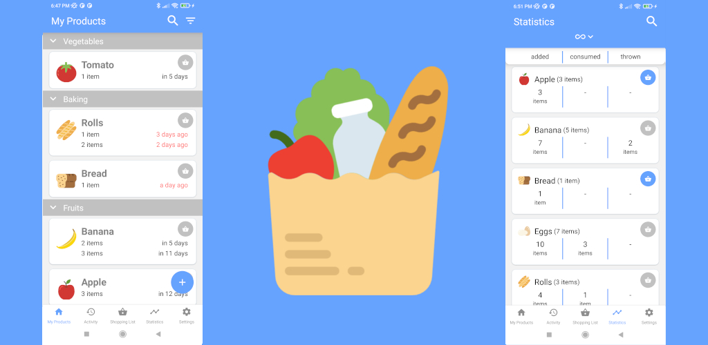
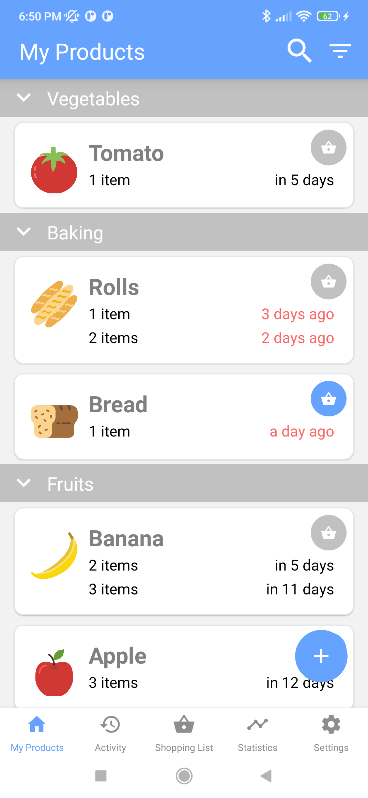
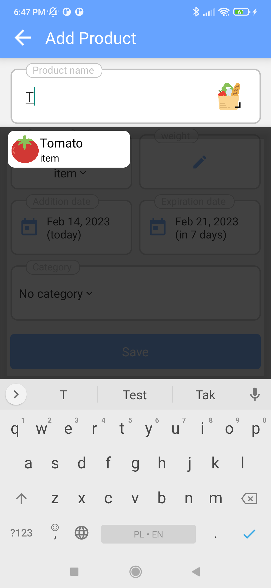
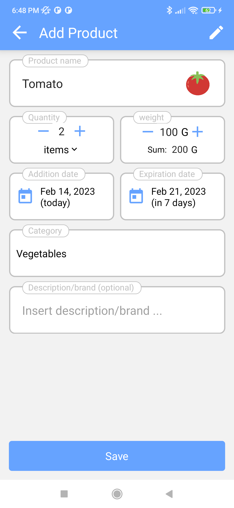
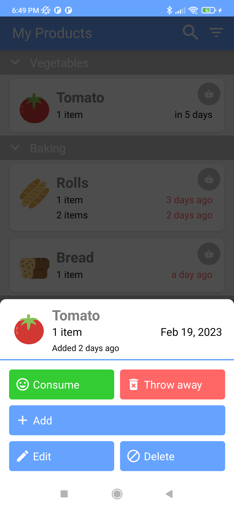
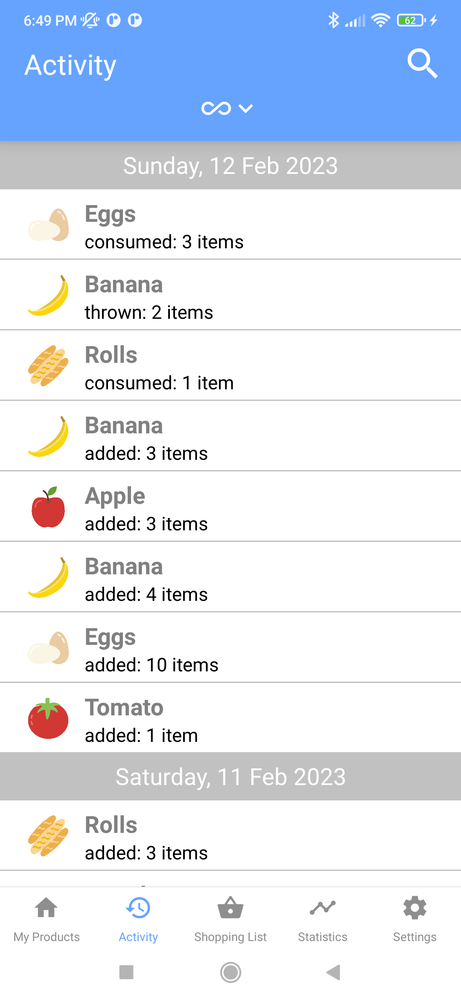
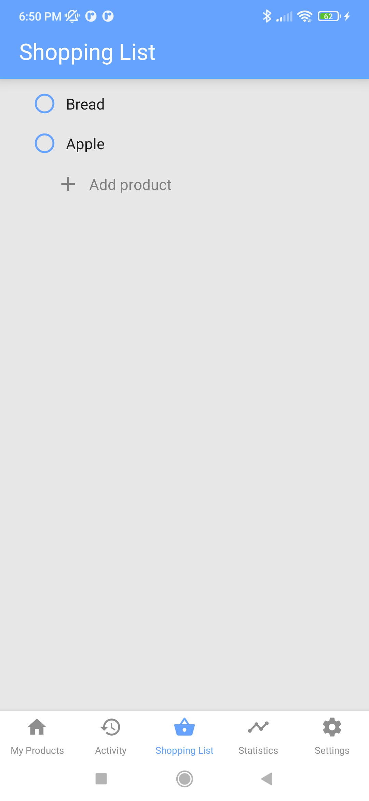
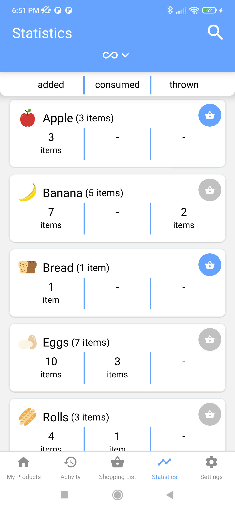

# My Fridge

## Description
An application supporting the zero waste philosophy, the aim of which is to support conscious and thoughtful buying and consumption of food.
The application allows:
* define different products in a clear and intuitive way
* add products to the list and track their expiration date
* mark products as used or thrown away
* view the list of operations on products
* create a shopping list

## Planned improvements
* Android versioning & build variants usage
* iOS release
* increase test coverage
* improve and release data storage in cloud
* smarter shopping list
* recepies based on available products
* add linter and prettier
* upgrade React Native and crucial libraries
* add main screen widget

## Privacy policy
All data provided by user is stored only locally on his device. No personal information collected.

## Contact
If you want to know more or contribute to the project contact me at: [stachurski.lukasz8@gmail.com](mailto:stachurski.lukasz8@gmail.com)
